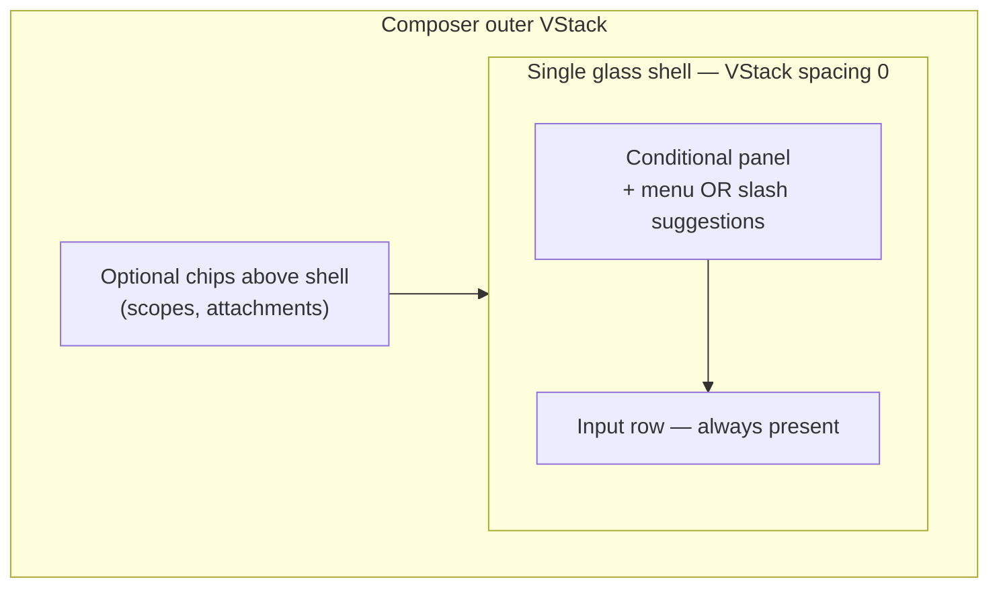

# Liquid Glass Composer Animation Reference

A reusable pattern for iOS chat-style input bars that expand smoothly inside a single Liquid Glass capsule. Covers the **+ menu slide-up** and **slash-command suggestion panel** animations.

Derived from a production iOS chat app (`ComposerViews.swift`, `ChatDetail.swift`). This document is **project-agnostic** — copy the patterns into any SwiftUI app targeting iOS 26+.

---

## The core insight

The animation is **not** a separate sheet or popover floating over the input. It is a **single expanding glass pill**:

1. One glass shell wraps **both** the optional panel and the text field.
2. The panel is inserted **above** the input row inside that shell (`VStack` with `spacing: 0`).
3. When the panel appears, the shell's **height grows upward**; SwiftUI animates layout + transition together.
4. The host screen uses `safeAreaInset(edge: .bottom)` so scroll content reflows as the dock rises.



If you split panel and input into **separate** glass views, you get a visible seam, double blur, and janky height changes during animation.

---

## Prerequisites

| Requirement | Notes |
|---|---|
| **iOS 26+** | Liquid Glass API: `View.glassEffect(_:in:)` |
| **SwiftUI** | `@State`, `@FocusState`, `Animation.smooth` |
| **Interactive glass** | Use `.regular.interactive()` for controls that respond to touch |
| **Do not use** | `.thinMaterial` / `.ultraThinMaterial` as panel fills — different visual language on iOS 26 |

### Glass shell recipe

Three layers on a matching shape:

1. `fill(.clear)` on the shape
2. `.glassEffect(.regular.interactive(), in: sameShape)`
3. `.overlay { shape.strokeBorder(hairlineColor.opacity(0.55), lineWidth: 0.75) }`

Circle controls use the same recipe with `Circle()` instead of `RoundedRectangle`.

---

## Design tokens (defaults)

Tune per app; these are proven production defaults:

| Token | Value | Purpose |
|---|---|---|
| Shell corner radius | `26` pt, `.continuous` | Pill shape |
| Circle control size | `38` pt | + / send / mic buttons |
| Shell horizontal padding | `6` pt outer, `9` pt text inset | Aligns content with rounded corners |
| Text field min height | `42` pt | Stable baseline before expansion |
| Plus popup animation | `Animation.smooth(duration: 0.2)` | Menu expand/collapse |
| Slash animation | `Animation.smooth(duration: 0.16)` | Faster — tied to typing rhythm |
| Plus transition | opacity + `.move(edge: .bottom)` (symmetric insert/remove) | Panel slides up into shell |
| Slash transition | insert: opacity + scale(`0.985`, anchor: `.bottom`); remove: opacity only | Subtle bloom in, soft fade out |
| Input top padding | `7` pt normally, `0` when slash panel visible | Tightens vertical rhythm |
| Dock backdrop height | `240` pt gradient | Soft fade into page background |

### Animation constants (copy-paste)

```swift
private enum ComposerChrome {
    static let cornerRadius: CGFloat = 26
    static let circleControlSize: CGFloat = 38
}

private let composerPopupAnimation = Animation.smooth(duration: 0.2)

private let composerPopupTransition = AnyTransition.asymmetric(
    insertion: .opacity.combined(with: .move(edge: .bottom)),
    removal: .opacity.combined(with: .move(edge: .bottom))
)

private let slashPanelTransition = AnyTransition.asymmetric(
    insertion: .opacity.combined(with: .scale(scale: 0.985, anchor: .bottom)),
    removal: .opacity
)
```

---

## Glass shell components

### Rounded shell (background of the pill)

```swift
private struct GlassShell: View {
    let cornerRadius: CGFloat
    let hairline: Color

    var body: some View {
        RoundedRectangle(cornerRadius: cornerRadius, style: .continuous)
            .fill(.clear)
            .glassEffect(
                .regular.interactive(),
                in: RoundedRectangle(cornerRadius: cornerRadius, style: .continuous)
            )
            .overlay {
                RoundedRectangle(cornerRadius: cornerRadius, style: .continuous)
                    .strokeBorder(hairline.opacity(0.55), lineWidth: 0.75)
            }
    }
}

private extension View {
    func glassShell(cornerRadius: CGFloat = 26, hairline: Color = .primary.opacity(0.12)) -> some View {
        background { GlassShell(cornerRadius: cornerRadius, hairline: hairline) }
    }
}
```

### Circle control (inline buttons inside the pill)

```swift
private struct GlassCircleButton: View {
    let systemImage: String
    var size: CGFloat = 38
    var iconSize: CGFloat = 15
    var foreground: Color = .secondary

    var body: some View {
        Image(systemName: systemImage)
            .font(.system(size: iconSize, weight: .bold))
            .foregroundStyle(foreground)
            .frame(width: size, height: size)
            .background {
                Circle()
                    .fill(.clear)
                    .glassEffect(.regular.interactive(), in: Circle())
            }
            .overlay {
                Circle()
                    .strokeBorder(Color.primary.opacity(0.12), lineWidth: 0.75)
            }
    }
}
```

---

## View hierarchy (the expanding shell)

```swift
VStack(alignment: .leading, spacing: 0) {
    // Panel slot — mutually exclusive branches
    if showingPlusMenu {
        PlusMenuPanel(...)
            .fixedSize(horizontal: false, vertical: true)
            .zIndex(1)
            .transition(composerPopupTransition)
    } else if showsSlashSuggestions {
        SlashSuggestionPanel(...)
            .transition(slashPanelTransition)
    }

    // Input row — never removed
    composerInputChrome
}
.glassShell()
.clipShape(RoundedRectangle(cornerRadius: cornerRadius, style: .continuous))
.compositingGroup()
.animation(.smooth(duration: 0.16), value: showsSlashSuggestions)
.animation(composerPopupAnimation, value: showingPlusMenu)
```

### Modifier order (critical)

Apply in this exact order:

| Order | Modifier | Why |
|---|---|---|
| 1 | `.glassShell()` (background) | Single blur layer for entire capsule |
| 2 | `.clipShape(RoundedRectangle(...))` | Glass respects pill bounds while height animates |
| 3 | `.compositingGroup()` | Composites glass + clip + child transitions as one layer — prevents flicker/tearing |
| 4 | `.animation(_, value:)` × 2 | Animates **layout height** when panel state changes, not just opacity |

**`.fixedSize(horizontal: false, vertical: true)`** on the plus panel gives it intrinsic height so the shell knows how far to grow. Omitting this can collapse panel height or cause layout ambiguity.

**`.zIndex(1)`** on the plus panel keeps it above sibling content during the transition edge.

---

## + menu: smooth upward expansion

### Interaction chain

1. **User taps +** → explicit animation wraps the toggle:

```swift
Button {
    withAnimation(composerPopupAnimation) {
        isOpen.toggle()
    }
} label: {
    GlassCircleButton(
        systemImage: "plus",
        foreground: isOpen ? .primary : .secondary
    )
}
```

Use **both** `withAnimation` on toggle **and** `.animation(composerPopupAnimation, value: showingPlusMenu)` on the shell. The button drives state; the parent animates layout.

2. **Panel placement** — above the text field, inside the same `VStack(spacing: 0)`.

3. **Transition** — symmetric bottom slide + fade:

```swift
.opacity.combined(with: .move(edge: .bottom))  // insert and remove
```

The panel visually rises from the input row; the glass shell grows to contain it.

4. **Dismiss triggers**:
   - Tap + again (toggle)
   - User types any non-empty text (`onChange(of: text)` sets `showingPlusMenu = false`)
   - Slash suggestions appear (`onChange(of: showsSlashSuggestions)` closes plus menu)

5. **Nested paging** (optional, inside plus panel): sub-pages use trailing-edge slide:

```swift
.transition(.asymmetric(
    insertion: .move(edge: .trailing).combined(with: .opacity),
    removal: .move(edge: .trailing).combined(with: .opacity)
))
.animation(composerPopupAnimation, value: page)
```

### Host layout (required for “dock rises smoothly”)

Pin the composer to the bottom of a scroll view so content reflows when the shell grows:

```swift
ScrollView {
    // transcript content
}
.safeAreaInset(edge: .bottom, spacing: 0) {
    VStack(spacing: 0) {
        ComposerBar(...)
            .padding(.horizontal, 16)
            .padding(.vertical, 12)
    }
    .background(alignment: .bottom) {
        ComposerDockBackdrop(pageBackground: pageBg)
    }
}
```

Without `safeAreaInset`, the transcript scrolls **under** the rising composer instead of making room for it.

---

## Slash command panel: fluid in/out

Separate animation profile from the + menu — faster and lighter because it follows typing.

### Trigger (computed, not toggled)

Derive visibility from text; no `@State` for “slash panel open”:

```swift
private var showsSlashSuggestions: Bool {
    guard let suggestions = slashSuggestions else { return false }
    return !suggestions.isEmpty
}

// Typical detection logic:
// - text starts with "/"
// - no whitespace yet in the token (still typing the command)
// - at least one matching suggestion exists
```

When the user completes a token (adds space), selects a suggestion, or deletes `/`, `showsSlashSuggestions` becomes `false` and the panel animates out — no manual close call.

### Mutually exclusive rendering

```swift
if showingPlusMenu {
    PlusMenuPanel(...)
} else if showsSlashSuggestions, let suggestions = slashSuggestions {
    SlashSuggestionPanel(...)
}
```

Never show both panels. Slash takes precedence over plus via `onChange`:

```swift
.onChange(of: showsSlashSuggestions) { _, showing in
    if showing {
        showingPlusMenu = false
        inputFocused = true
    }
}
```

### Focus preservation

Keep the slash panel **inside the same stable shell** as the `TextField`. The source code comment explains why:

> Slash-command suggestions appear in the same stable shell as the text field so the keyboard does not resign focus when the panel animates in.

Also re-assert focus when slash panel appears:

```swift
.focused($inputFocused)  // on TextField
// ...
.onChange(of: showsSlashSuggestions) { _, showing in
    if showing { inputFocused = true }
}
```

Do **not** present slash suggestions in a `.sheet`, `.popover`, or separate view hierarchy — that breaks focus and breaks the single-shell grow effect.

### Transition (asymmetric)

```swift
// Insert: slight scale-up from bottom anchor + fade
.opacity.combined(with: .scale(scale: 0.985, anchor: .bottom))

// Remove: fade only (no scale — feels softer on dismiss)
.opacity
```

Parent animation: `.animation(.smooth(duration: 0.16), value: showsSlashSuggestions)` — **0.04s faster** than plus menu.

### Padding compensation

When slash panel is visible, reduce top padding on the input row so content doesn't feel double-spaced:

```swift
.padding(.top, showsSlashSuggestions ? 0 : 7)
```

### Optional polish: committed slash overlay

Separate from panel animation — a read-only overlay that styles the committed `/command` token in the text field (invisible `/` for caret alignment, shimmer on slug). Does not affect glass motion; add only if your product needs committed-token styling.

---

## Dock backdrop (companion pattern)

A **non-glass** bottom gradient using the page background color so the expanded composer blends into the screen edge instead of looking like a floating plate.

```swift
struct ComposerDockBackdrop: View {
    var pageBackground: Color
    private let fadeHeight: CGFloat = 240

    var body: some View {
        LinearGradient(
            stops: [
                .init(color: pageBackground.opacity(0), location: 0),
                .init(color: pageBackground.opacity(0.32), location: 0.34),
                .init(color: pageBackground.opacity(0.82), location: 0.68),
                .init(color: pageBackground, location: 1)
            ],
            startPoint: .top,
            endPoint: .bottom
        )
        .frame(height: fadeHeight)
        .frame(maxWidth: .infinity)
        .offset(y: 92)
        .frame(maxWidth: .infinity, alignment: .bottom)
        .ignoresSafeArea(edges: .bottom)
        .allowsHitTesting(false)
    }
}
```

Place behind the composer in the `safeAreaInset` container, not inside the glass shell.

---

## State coordination checklist

Use this when implementing in a new project:

- [ ] One glass shell wraps panel + input (not two glass views)
- [ ] Panel inserted **above** input in `VStack(spacing: 0)`
- [ ] Plus menu: `@State` + `withAnimation` on toggle
- [ ] Slash panel: computed bool from text (no separate open state)
- [ ] `if plusMenu … else if slash` — one panel at a time
- [ ] Typing non-empty text closes plus menu
- [ ] Slash appearing closes plus menu and keeps keyboard focused
- [ ] `.fixedSize(horizontal: false, vertical: true)` on plus panel
- [ ] Modifier order: glass → clipShape → compositingGroup → animation
- [ ] Host uses `safeAreaInset(edge: .bottom)` for scroll reflow
- [ ] Optional dock backdrop gradient behind composer
- [ ] Use `Animation.smooth`, not default spring (unless you want bounce)
- [ ] Do not use `.sheet` / `.popover` for inline expansion

---

## Pitfalls and debugging

| Symptom | Likely cause | Fix |
|---|---|---|
| Panel fades but shell jumps | Missing `.animation(_, value:)` on shell | Add parent animation bound to panel state |
| Double blur / seam during expand | Separate glass on panel vs input | Single shell background on outer `VStack` |
| Glass flickers while animating | Missing `.compositingGroup()` | Add after `clipShape` |
| Panel has zero height | Missing `.fixedSize(horizontal: false, vertical: true)` | Add to panel |
| Content scrolls under composer | No `safeAreaInset` | Pin composer in bottom inset |
| Keyboard dismisses on `/` | Panel outside `@FocusState` tree | Keep panel inside same view as `TextField` |
| Slash feels sluggish vs typing | Same duration as plus menu | Use 0.16s for slash, 0.2s for plus |
| Wrong visual era | Using `.thinMaterial` | Switch to `glassEffect(.regular.interactive())` on iOS 26 |

---

## Minimal reusable skeleton

Complete stripped-down example (~100 lines). No app-specific dependencies.

```swift
import SwiftUI

// MARK: - Tokens

private enum Chrome {
    static let cornerRadius: CGFloat = 26
    static let circleSize: CGFloat = 38
}

private let popupAnimation = Animation.smooth(duration: 0.2)
private let slashAnimation = Animation.smooth(duration: 0.16)

private let popupTransition = AnyTransition.asymmetric(
    insertion: .opacity.combined(with: .move(edge: .bottom)),
    removal: .opacity.combined(with: .move(edge: .bottom))
)

// MARK: - Glass primitives

private struct GlassShell: View {
    var body: some View {
        RoundedRectangle(cornerRadius: Chrome.cornerRadius, style: .continuous)
            .fill(.clear)
            .glassEffect(.regular.interactive(), in: RoundedRectangle(cornerRadius: Chrome.cornerRadius, style: .continuous))
            .overlay {
                RoundedRectangle(cornerRadius: Chrome.cornerRadius, style: .continuous)
                    .strokeBorder(.primary.opacity(0.12), lineWidth: 0.75)
            }
    }
}

// MARK: - Composer

struct ExpandableGlassComposer: View {
    @State private var text = ""
    @State private var showingPlusMenu = false
    @FocusState private var focused: Bool

    private let slashCommands = ["help", "clear", "settings"]

    private var slashSuggestions: [String] {
        guard text.hasPrefix("/") else { return [] }
        let token = String(text.dropFirst())
        guard !token.contains(" ") else { return [] }
        return slashCommands.filter { $0.hasPrefix(token.lowercased()) }
    }

    private var showsSlashSuggestions: Bool {
        !slashSuggestions.isEmpty
    }

    var body: some View {
        VStack(alignment: .leading, spacing: 0) {
            if showingPlusMenu {
                plusPanel
                    .fixedSize(horizontal: false, vertical: true)
                    .zIndex(1)
                    .transition(popupTransition)
            } else if showsSlashSuggestions {
                slashPanel
                    .transition(.asymmetric(
                        insertion: .opacity.combined(with: .scale(scale: 0.985, anchor: .bottom)),
                        removal: .opacity
                    ))
            }

            inputRow
        }
        .background { GlassShell() }
        .clipShape(RoundedRectangle(cornerRadius: Chrome.cornerRadius, style: .continuous))
        .compositingGroup()
        .animation(slashAnimation, value: showsSlashSuggestions)
        .animation(popupAnimation, value: showingPlusMenu)
        .onChange(of: text) { _, value in
            if !value.trimmingCharacters(in: .whitespacesAndNewlines).isEmpty {
                showingPlusMenu = false
            }
        }
        .onChange(of: showsSlashSuggestions) { _, showing in
            if showing {
                showingPlusMenu = false
                focused = true
            }
        }
    }

    private var plusPanel: some View {
        VStack(alignment: .leading, spacing: 8) {
            Text("Actions").font(.caption.weight(.semibold)).foregroundStyle(.secondary)
            Button("Attach photo") { showingPlusMenu = false }
            Button("Attach file") { showingPlusMenu = false }
        }
        .frame(maxWidth: .infinity, alignment: .leading)
        .padding(.horizontal, 12)
        .padding(.top, 12)
        .padding(.bottom, 8)
    }

    private var slashPanel: some View {
        VStack(alignment: .leading, spacing: 0) {
            Text("Suggestions").font(.caption.weight(.semibold)).foregroundStyle(.secondary)
                .padding(.horizontal, 12).padding(.top, 10).padding(.bottom, 6)
            ForEach(slashSuggestions, id: \.self) { cmd in
                Button("/\(cmd)") { text = "/\(cmd) " }
                    .frame(maxWidth: .infinity, alignment: .leading)
                    .padding(.horizontal, 12).padding(.vertical, 9)
            }
        }
    }

    private var inputRow: some View {
        VStack(spacing: 2) {
            TextField("Message", text: $text, axis: .vertical)
                .lineLimit(1...5)
                .padding(.horizontal, 9)
                .padding(.top, 8)
                .frame(minHeight: 42, alignment: .topLeading)
                .focused($focused)

            HStack {
                Button {
                    withAnimation(popupAnimation) { showingPlusMenu.toggle() }
                } label: {
                    Image(systemName: "plus")
                        .frame(width: Chrome.circleSize, height: Chrome.circleSize)
                }
                .buttonStyle(.plain)
                Spacer()
            }
            .padding(.horizontal, 6)
        }
        .padding(.horizontal, 6)
        .padding(.top, showsSlashSuggestions ? 0 : 7)
        .padding(.bottom, 6)
    }
}

// MARK: - Host (chat screen)

struct ChatScreen: View {
    var body: some View {
        ScrollView {
            LazyVStack(spacing: 12) {
                ForEach(0..<20, id: \.self) { i in
                    Text("Message \(i)").frame(maxWidth: .infinity, alignment: .leading)
                }
            }
            .padding()
        }
        .scrollDismissesKeyboard(.interactively)
        .safeAreaInset(edge: .bottom, spacing: 0) {
            ExpandableGlassComposer()
                .padding(.horizontal, 16)
                .padding(.vertical, 12)
        }
    }
}
```

---

## Related pattern: fixed-size glass button (not expanding)

The same `glassEffect(.regular.interactive())` API appears on **fixed-size** controls that do not expand — e.g. a drawer footer "New Chat" capsule with a filled accent background + glass on top. That is a different use case: decorative/interactive button chrome, not an expanding input shell. Reuse the glass API and stroke overlay; do not copy the expanding-shell layout.

---

## Reference appendix (source map)

| File | What to read |
|---|---|
| `ComposerViews.swift` L11–21 | Animation constants and transitions |
| `ComposerViews.swift` L23–66 | `ComposerGlassShell`, `ComposerGlassCircle`, `composerGlassShell()` |
| `ComposerViews.swift` L68–92 | `ComposerDockBackdrop` |
| `ComposerViews.swift` L182–265 | Expanding shell, state coordination, focus |
| `ComposerViews.swift` L268–315 | Input chrome, slash padding compensation |
| `ComposerViews.swift` L849–886 | `ComposerSlashSuggestionPanel` |
| `ComposerViews.swift` L977–1057 | `ComposerPlusMenu`, nested page transitions |
| `Chat/ChatDetail.swift` L153–155 | `safeAreaInset` host integration |
| `Chat/ChatDetail.swift` L230–286 | `chatComposerInset` + dock backdrop |
| `Workspace/WorkspaceShell.swift` L449–466 | Fixed-size glass capsule button (drawer) |

**Platform target:** iOS 26.2+ / Liquid Glass era (`glassEffect` API).

---

## Quick decision guide

| You want… | Do this |
|---|---|
| Menu that rises from the input | Panel above input in single shell; bottom move + 0.2s smooth |
| Typing-triggered suggestions | Computed bool; scale-from-bottom insert; 0.16s smooth |
| Smooth scroll reflow | `safeAreaInset(edge: .bottom)` on host scroll view |
| No keyboard drop on panel show | Same shell + `@FocusState` on `TextField` |
| Polished dock edge | Page-bg gradient backdrop behind composer, not inside glass |
| Bouncy motion | Replace `Animation.smooth` with spring — intentional product choice |
