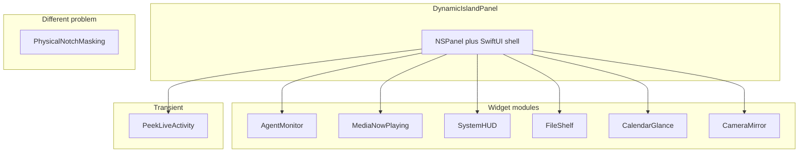

# Ecosystem Landscape

> Read when: choosing which notch product archetype to build, comparing OSS references, or checking licenses. Back to [SKILL.md](SKILL.md).

This document audits the public **macbook-notch** ecosystem ([GitHub topic](https://github.com/topics/macbook-notch)) plus the dominant reference app **boring.notch**. Use it to pick module types and to avoid copying GPL code without compliance.

---

## Taxonomy

Not every repo tagged `macbook-notch` solves the same problem.

| Category | What it is | Build using |
|----------|------------|-------------|
| **Dynamic Island panel** | Floating `NSPanel` + SwiftUI shell + modules | [foundations.md](foundations.md) + module spokes |
| **Agent monitor** | Session/status rows for coding tools | [module-agent-monitor.md](module-agent-monitor.md) |
| **Physical notch masking** | Hide/show the hardware notch on screen | Not this skill — see repos below |
| **Linux / GNOME** | Non-macOS desktop shell | Out of scope |

---

## Comparison matrix

| Project | Stars | Lang | License | Notch type | Notable modules |
|---------|------:|------|---------|------------|-----------------|
| [TheBoredTeam/boring.notch](https://github.com/TheBoredTeam/boring.notch) | ~9.5k | Swift | **GPL-3.0** | Full cockpit | Media, HUD, shelf, calendar, battery, gestures — primary pattern reference |
| [zkondor/znotch](https://github.com/zkondor/znotch) | 113 | — | Check repo | **Physical hide/show** | Toggles visibility of M1/M2 notch — not a panel app |
| [coaxel2/NotchIA](https://github.com/coaxel2/NotchIA) | 0 | Swift | Check repo | Full cockpit | Media, calendar, shelf, focus, clipboard, on-device AI, **agent tracking** |
| [kozhydlo/NotchMac](https://github.com/kozhydlo/NotchMac) | 0 | Swift | Check repo | Dynamic Island replacement | Animations, indicators |
| [omerates760/AgentPulse](https://github.com/omerates760/AgentPulse) | 1 | Swift | Check repo | **Agent monitor** | Claude Code, Cursor, Codex, Gemini sessions |
| [badursun/MacCam-NotchIsland](https://github.com/badursun/MacCam-NotchIsland) | 0 | Swift | Check repo | **Camera mirror** | Live preview, photo capture, glass backdrop |
| [paralevel/hide-the-macbook-notch](https://github.com/paralevel/hide-the-macbook-notch) | 0 | AppleScript | Check repo | **Physical masking** | Script-based notch disappearance |
| [NexVar/NexNotch](https://github.com/NexVar/NexNotch) | 2 | JavaScript | Check repo | Linux GNOME | Inspiration only — not macOS |

Stars and licenses change; verify on GitHub before shipping derivative work.

---

## GPL and boring.notch

**boring.notch** is the most complete open reference for Dynamic Island behavior on macOS. It is licensed under **GPL-3.0**.

| Allowed | Not allowed without GPL compliance |
|---------|-----------------------------------|
| Study architecture, timing, and UX patterns | Copy-paste Swift source into a proprietary app |
| Reimplement behaviors from this skill’s spokes | Fork code and distribute without GPL obligations |

This skill documents **patterns**, not GPL source. When a spoke cites boring.notch, treat it as behavioral reference only.

---

## Module → spoke map

| User goal | Read |
|-----------|------|
| New notch shell (panel, shape, state) | [foundations.md](foundations.md) |
| Hover, drag, springs | [interactions-and-motion.md](interactions-and-motion.md) |
| Black shell, open layout density | [visual-system.md](visual-system.md) |
| Now playing | [module-media-now-playing.md](module-media-now-playing.md) |
| Volume / brightness HUD | [module-system-hud.md](module-system-hud.md) + [module-peek-transient.md](module-peek-transient.md) |
| File drop shelf | [module-file-shelf.md](module-file-shelf.md) |
| Calendar glance | [module-calendar-glance.md](module-calendar-glance.md) |
| Camera preview | [module-camera-mirror.md](module-camera-mirror.md) |
| Coding-agent status | [module-agent-monitor.md](module-agent-monitor.md) |
| Ship menu bar, prefs, QA | [integration-shipping.md](integration-shipping.md) |

---

## Physical notch masking (out of scope)

**znotch** and **hide-the-macbook-notch** change how the **hardware notch** appears on screen. They do not implement an `NSPanel` Dynamic Island.

If the user asks to “hide the MacBook notch,” route them to those utilities — do not apply the Dynamic Island panel spokes unless they also want a floating notch app.

---

## Keeping this doc current

1. Re-scan [github.com/topics/macbook-notch](https://github.com/topics/macbook-notch) periodically.
2. Update module spokes when a new archetype appears (e.g. focus timers, clipboard history).

---

## Reference appendix (sources)

- GitHub topic: https://github.com/topics/macbook-notch
- boring.notch: https://github.com/TheBoredTeam/boring.notch (GPL-3.0)
- Audit date: 2026-06-03
