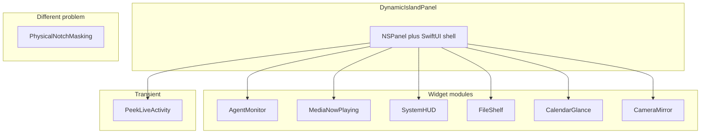

# Ecosystem Landscape

> Read when: choosing which notch product archetype to build, comparing OSS references, or checking licenses. Back to [SKILL.md](SKILL.md).

This document audits the public **macbook-notch** ecosystem ([GitHub topic](https://github.com/topics/macbook-notch)) plus the dominant reference app **boring.notch** (not always topic-tagged). Use it to pick module types and to avoid copying GPL code without compliance.

**Audit date:** 2026-06-03 — re-verify stars and licenses on GitHub before derivative work.

---

## Taxonomy

Not every repo tagged `macbook-notch` solves the same problem.

| Category | What it is | Build using |
|----------|------------|-------------|
| **Dynamic Island panel** | Floating `NSPanel` + SwiftUI shell + modules | [foundations.md](foundations.md) + module spokes |
| **Agent monitor** | Session/status rows for coding tools | [module-agent-monitor.md](module-agent-monitor.md) |
| **Physical notch masking** | Hide/show the hardware notch on screen | Not this skill — see repos below |
| **Linux / GNOME** | Non-macOS desktop shell | Out of scope |

---

## Comparison matrix

| Project | Stars | Platform | Lang | License | Notch type | Notable modules / features |
|---------|------:|----------|------|---------|------------|----------------------------|
| [TheBoredTeam/boring.notch](https://github.com/TheBoredTeam/boring.notch) | ~9.5k | macOS 14+ | Swift | **GPL-3.0** | Full cockpit | Music + visualizer, calendar, reminders, mirror, shelf + AirDrop, volume/brightness/backlight HUD, charging %, gestures, sizing per display |
| [zkondor/znotch](https://github.com/zkondor/znotch) | 113 | macOS (M1/M2) | — | Other | **Physical hide/show** | Toggle hardware notch visibility — **not** a panel app; repo **archived** |
| [coaxel2/NotchIA](https://github.com/coaxel2/NotchIA) | 0 | macOS 15+ | Swift | **GPL-3.0** | Full cockpit | Media (multi-source + lyrics), shelf + conversions, calendar/reminders, clipboard, Pomodoro, system HUD, **Claude/Codex/Copilot agent tab** |
| [kozhydlo/NotchMac](https://github.com/kozhydlo/NotchMac) | 0 | macOS 14+, notch MacBooks | Swift | MIT (badge) | Dynamic Island replacement | HUD modes (minimal / bar / notched), now playing (many players), battery plug/unplug, lock-screen indicator (SkyLight) |
| [omerates760/AgentPulse](https://github.com/omerates760/AgentPulse) | 1 | macOS 13+ | Swift | **MIT** | **Agent monitor** | Claude Code, Cursor, Codex, Gemini — hooks, approvals, questions from notch |
| [badursun/MacCam-NotchIsland](https://github.com/badursun/MacCam-NotchIsland) | 0 | macOS 13+ | Swift | **MIT** | **Camera mirror** | Deploy animation, live preview, photo capture, frosted glass backdrop |
| [paralevel/hide-the-macbook-notch](https://github.com/paralevel/hide-the-macbook-notch) | 0 | macOS | AppleScript | **MIT** | **Physical masking** | Script-based notch disappearance |
| [NexVar/NexNotch](https://github.com/NexVar/NexNotch) | 2 | Linux GNOME 49+ | JavaScript | Other | Desktop shell | UX inspiration only — not macOS |

**Topic coverage:** All repos above except **boring.notch** appear on [github.com/topics/macbook-notch](https://github.com/topics/macbook-notch). boring.notch is included because it is the de facto reference implementation.

### Emerging modules (OSS only — no dedicated spoke yet)

| Module | Seen in | Notes |
|--------|---------|-------|
| Clipboard history | NotchIA | Compact list; privacy-sensitive |
| Pomodoro / focus timer | NotchIA, NexNotch | Peek or tab; avoid dominating open layout |
| File format conversion | NotchIA | Shelf extension; run off main thread |
| Lock screen widget | boring.notch roadmap | Private API risk — see [foundations.md](foundations.md) |
| Bluetooth live activity | boring.notch roadmap | Connect/disconnect peek |

---

## GPL and boring.notch

**boring.notch** is the most complete open reference for Dynamic Island behavior on macOS. It is licensed under **GPL-3.0**. **NotchIA** is also GPL-3.0.

| Allowed | Not allowed without GPL compliance |
|---------|-----------------------------------|
| Study architecture, timing, and UX patterns | Copy-paste Swift source into a proprietary app |
| Reimplement behaviors from this skill’s spokes | Fork GPL code and distribute without GPL obligations |

This skill documents **patterns**, not GPL source. When a spoke cites boring.notch or NotchIA, treat them as behavioral reference only.

**Distribution note:** boring.notch ships outside the Mac App Store (unsigned / quarantine bypass). Your app’s distribution model may differ — do not copy their install story unless it fits your product.

---

## Picking a reference by goal

| You want to… | Start with | License note |
|--------------|------------|----------------|
| Full-feature consumer notch app | boring.notch patterns → this skill’s spokes | GPL if you fork their code |
| Agent-only utility | AgentPulse + [module-agent-monitor.md](module-agent-monitor.md) | MIT-friendly reference |
| Camera-only utility | MacCam + [module-camera-mirror.md](module-camera-mirror.md) | MIT |
| HUD + media without GPL | NotchMac + spokes (reimplement, don’t copy) | Verify repo license file |
| Hide the physical notch | znotch or hide-the-macbook-notch | Out of scope for panel spokes |

---

## Module → spoke map

| User goal | Read |
|-----------|------|
| New notch shell (panel, shape, state) | [foundations.md](foundations.md) |
| Hover, drag, springs | [interactions-and-motion.md](interactions-and-motion.md) |
| Black shell, open layout density | [visual-system.md](visual-system.md) |
| Now playing | [module-media-now-playing.md](module-media-now-playing.md) |
| Volume / brightness HUD | [module-system-hud.md](module-system-hud.md) + [module-peek-transient.md](module-peek-transient.md) |
| File drop shelf | [module-file-shelf.md](module-file-shelf.md) |
| Calendar glance | [module-calendar-glance.md](module-calendar-glance.md) |
| Camera preview | [module-camera-mirror.md](module-camera-mirror.md) |
| Coding-agent status | [module-agent-monitor.md](module-agent-monitor.md) |
| Ship menu bar, prefs, QA | [integration-shipping.md](integration-shipping.md) |

---

## Physical notch masking (out of scope)

**znotch** and **hide-the-macbook-notch** change how the **hardware notch** appears on screen. They do not implement an `NSPanel` Dynamic Island.

If the user asks to “hide the MacBook notch,” route them to those utilities — do not apply the Dynamic Island panel spokes unless they also want a floating notch app.

---

## Keeping this doc current

1. Re-scan [github.com/topics/macbook-notch](https://github.com/topics/macbook-notch) and check **boring.notch** releases periodically.
2. Update module spokes when a new archetype stabilizes (e.g. clipboard, focus timers).
3. Record audit date at the top when you refresh stars or licenses.

---

## Reference appendix (sources)

- GitHub topic: https://github.com/topics/macbook-notch
- boring.notch: https://github.com/TheBoredTeam/boring.notch (GPL-3.0)
- NotchIA: https://github.com/coaxel2/NotchIA (GPL-3.0)
- AgentPulse: https://github.com/omerates760/AgentPulse (MIT)
- MacCam-NotchIsland: https://github.com/badursun/MacCam-NotchIsland (MIT)
- NotchMac: https://github.com/kozhydlo/NotchMac
